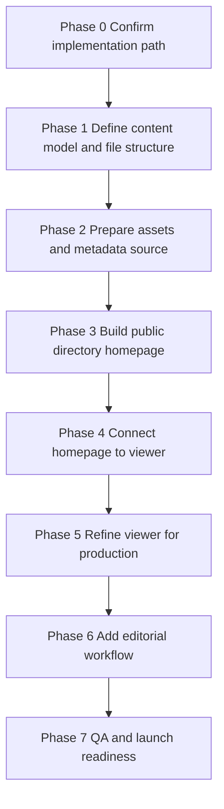

# Finalized Implementation Phases Checklist

## Purpose

This document combines the implementation guidance from [`plans/pdf-site-implementation-plan.md`](plans/pdf-site-implementation-plan.md) and [`plans/netlify-decap-cms-implementation-plan.md`](plans/netlify-decap-cms-implementation-plan.md) into one construction-ready checklist.

It stays platform-agnostic for the core site architecture and treats Netlify + Decap CMS as a dedicated implementation phase rather than the only possible path.

Status note: the checklist below has been updated to reflect the first completed implementation pass for the public site in [`index.html`](index.html), [`assets/site.js`](assets/site.js), [`assets/site.css`](assets/site.css), [`data/zines.json`](data/zines.json), and the viewer integration updates in [`Zaya-main/index.html`](Zaya-main/index.html).

## Final recommended direction

- Build the public site as a static zine directory plus a PDF viewer.
- Keep the existing viewer foundation centered around [`Zaya-main/index.html`](Zaya-main/index.html), [`loadApplication()`](Zaya-main/lib/js/app.js:30), and [`loadFlipbook()`](Zaya-main/lib/js/core/load.js:86).
- Use a single normalized metadata shape for all zines.
- Keep hosting and editorial tooling loosely coupled to the public site so the stack can evolve later.
- Treat Netlify + Decap CMS as the first editorial workflow implementation, not a hard architectural dependency.

## Delivery flow



## Phase 0: Confirm implementation path

Goal: lock the project decisions before construction starts.

Checklist:

- [x] Confirm the public experience will be a homepage directory plus viewer flow.
- [x] Confirm the existing viewer in [`Zaya-main/index.html`](Zaya-main/index.html) remains the base implementation.
- [x] Confirm whether the viewer remains at [`Zaya-main/index.html`](Zaya-main/index.html) or is later duplicated into a cleaner dedicated viewer page.
- [ ] Confirm the initial hosting target.
- [x] Confirm Netlify + Decap CMS is phase-based editorial tooling, not a blocker for the public site build.
- [x] Confirm the two source planning docs remain as reference documents and this file becomes the primary execution checklist.

## Phase 1: Define the content model and repository structure

Goal: create one source of truth for zine metadata and asset locations.

### Required normalized zine fields

- [x] Define `id`.
- [x] Define `title`.
- [x] Define `slug`.
- [x] Define `description`.
- [x] Define `date`.
- [x] Define `thumbnail`.
- [x] Define `pdf` or `pdfPath`.

### Recommended optional fields

- [x] Define `featured`.
- [x] Define `draft`.
- [x] Define `category`.
- [x] Define `tags`.
- [x] Define `author` if needed.

### Repository structure checklist

- [x] Confirm where public PDF files will live.
- [x] Confirm where thumbnail images will live.
- [x] Confirm where normalized zine metadata will live.
- [ ] Confirm whether raw editorial entries are stored separately from generated site data.
- [x] Keep viewer assets and scripts under [`Zaya-main/`](Zaya-main).

### Recommended target structure

```text
site-root/
  plans/
  Zaya-main/
  data/
  assets/
  content/
  admin/
```

## Phase 2: Prepare assets and metadata source

Goal: make the zine inventory consumable by the public homepage.

Checklist:

- [x] Create the initial zine inventory source.
- [x] Add at least one representative PDF file.
- [x] Add at least one matching thumbnail image.
- [x] Normalize every entry into one consistent shape.
- [x] Ensure each entry points to a valid thumbnail URL.
- [x] Ensure each entry points to a valid PDF URL.
- [x] Decide whether the homepage reads a static JSON file directly or reads build-generated data.
- [x] Decide whether editorial source files are markdown entries, JSON entries, or another static-friendly format.

### Output requirement for this phase

- [x] Produce a homepage-readable inventory file such as [`data/zines.json`](data/zines.json).

## Phase 3: Build the public directory homepage

Goal: create the browsing surface for all zines.

Checklist:

- [x] Create the homepage entry point.
- [x] Load the normalized zine metadata source.
- [x] Render one card per zine.
- [x] Show thumbnail, title, description, and date on each card.
- [x] Add an open action on each card.
- [x] Add an empty state when no zines exist.
- [x] Ensure the layout works on mobile and desktop.

### Recommended version 1 features

- [x] Basic hero or intro section.
- [x] Grid or list layout.
- [x] Card-level open button.
- [x] Basic branding alignment with the viewer.

### Recommended version 2 features

- [ ] Featured zines section.
- [ ] Search by title or tag.
- [ ] Category or tag filters.
- [ ] Sort by date or title.

## Phase 4: Connect the homepage to the viewer

Goal: make zine selection dynamic without introducing unnecessary routing complexity.

Checklist:

- [x] Use query-parameter-based linking for the first release.
- [x] Build links in the form of [`Zaya-main/index.html?pdf=/path/to/file.pdf`](Zaya-main/index.html).
- [x] Verify the viewer can open PDFs using the existing query-parameter flow.
- [x] Preserve a default PDF fallback path in case the selected PDF fails.
- [ ] Optionally support a `page` query parameter later.
- [x] Verify every homepage card resolves to a valid viewer URL.

### Viewer integration checkpoints

- [x] Confirm the selected PDF reaches [`loadFlipbook()`](Zaya-main/lib/js/core/load.js:86).
- [x] Confirm application bootstrap still runs through [`loadApplication()`](Zaya-main/lib/js/app.js:30).
- [ ] Confirm asset paths work in the deployed environment.

## Phase 5: Refine the viewer for production

Goal: keep the reading experience focused on the zine library use case.

Checklist:

- [x] Audit the current UI in [`Zaya-main/index.html`](Zaya-main/index.html).
- [x] Keep core reading controls.
- [x] Decide whether outline and thumbnails stay enabled.
- [x] Decide whether download remains visible.
- [x] Remove or hide non-essential promotional or demo-oriented UI.
- [x] Align branding and navigation with the homepage.
- [x] Confirm the viewer still behaves correctly after UI cleanup.

### Default keep list

- [x] PDF rendering.
- [x] Next and previous navigation.
- [x] Page number control.
- [x] Fullscreen control.

### Default trim list

- [x] Demo-specific links.
- [x] Changelog-oriented UI.
- [x] Media-player-specific UI if it is not part of the zine experience.
- [x] Decorative or unrelated widgets that distract from reading.

## Phase 6: Add editorial workflow

Goal: allow non-technical contributors to create and publish new zines consistently.

This phase is implementation-specific. The public site should already be valid before this phase begins.

### Phase 6A: Editorial workflow decisions

- [ ] Confirm whether editors will work through Git directly, a CMS, or a lightweight internal process.
- [ ] Confirm who can upload PDFs and thumbnails.
- [ ] Confirm filename rules and slug rules.
- [ ] Confirm whether drafts should be hidden from the homepage.
- [ ] Confirm whether featured entries need homepage prominence.

### Phase 6B: Netlify + Decap CMS implementation

Use this phase if Netlify + Decap CMS is the chosen editorial workflow.

- [ ] Add [`admin/index.html`](admin/index.html).
- [ ] Add [`admin/config.yml`](admin/config.yml).
- [ ] Create [`content/zines/`](content/zines).
- [ ] Create asset upload locations for thumbnails and PDFs.
- [ ] Connect the repository to Netlify.
- [ ] Enable Netlify Identity.
- [ ] Enable Git Gateway.
- [ ] Invite editors.
- [ ] Configure the `zines` collection with the normalized fields.
- [ ] Ensure uploaded files resolve to public URLs that the homepage and viewer can consume.
- [ ] Decide whether markdown entries are read directly or converted into generated JSON.
- [ ] If generated JSON is used, define the transformation step from CMS entries into homepage data.
- [ ] Hide entries marked as draft from the public directory.
- [ ] Surface entries marked as featured where appropriate.

### Editorial acceptance checklist

- [ ] Log into the CMS as an invited editor.
- [ ] Create one complete test zine entry.
- [ ] Upload one thumbnail.
- [ ] Upload one PDF.
- [ ] Publish the entry.
- [ ] Confirm the repository receives the new content.
- [ ] Confirm the deploy completes successfully.
- [ ] Confirm the homepage shows the new zine.
- [ ] Confirm the viewer opens the uploaded PDF.

## Phase 7: QA and launch readiness

Goal: verify the site is reliable before launch.

### Functional QA

- [ ] Test homepage rendering with multiple zines.
- [ ] Test homepage rendering with zero zines.
- [ ] Test every homepage card link.
- [ ] Test fallback behavior when a PDF path is broken.
- [ ] Test missing thumbnail behavior.
- [ ] Test draft filtering behavior.
- [ ] Test featured rendering behavior if implemented.

### Device and layout QA

- [ ] Test desktop layout.
- [ ] Test mobile layout.
- [ ] Test different viewport widths.
- [ ] Test large PDFs.

### Asset and path QA

- [ ] Confirm all asset paths are relative or deployment-safe.
- [ ] Confirm thumbnails load in production.
- [ ] Confirm PDFs load in production.
- [ ] Avoid remote PDFs unless cross-origin access is guaranteed.

### Deployment QA

- [ ] Confirm the selected hosting platform serves static files correctly.
- [ ] Confirm direct access to the homepage works.
- [ ] Confirm direct access to the viewer works.
- [ ] Confirm deep links with PDF query parameters work in production.
- [ ] Confirm the admin route works if the editorial workflow phase is enabled.

## Launch checklist

- [x] Public homepage is complete.
- [x] Viewer integration is complete.
- [ ] At least one production-ready zine is loaded.
- [x] Branding is consistent across homepage and viewer.
- [ ] Core QA is complete.
- [ ] Hosting is configured.
- [ ] Editorial workflow is validated if enabled.
- [x] This checklist has been translated into implementation tasks.

## Build sequence for execution

1. Complete Phase 0.
2. Complete Phase 1.
3. Complete Phase 2.
4. Complete Phase 3.
5. Complete Phase 4.
6. Complete Phase 5.
7. Complete Phase 6 only after the public experience is working.
8. Complete Phase 7 before launch.

## Handoff note

This file should be treated as the primary implementation checklist for the next execution pass. The earlier documents remain useful references:

- [`plans/pdf-site-implementation-plan.md`](plans/pdf-site-implementation-plan.md)
- [`plans/netlify-decap-cms-implementation-plan.md`](plans/netlify-decap-cms-implementation-plan.md)
