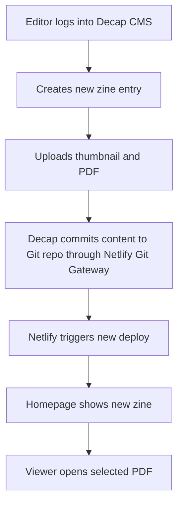

# Netlify + Decap CMS Implementation Plan

## Objective

Set up a simple editorial workflow where non-technical users can add new zines through an admin interface.

Each zine entry should include:

- title
- description
- publication date
- thumbnail image
- PDF file

The public site remains a static site, while Decap CMS provides the content editing UI and Netlify provides hosting, authentication, Git Gateway, deploy previews, and deployment automation.

## Why this approach fits the current project

The existing implementation plan in [`plans/pdf-site-implementation-plan.md`](./pdf-site-implementation-plan.md) already recommends a static PDF library built around the existing viewer.

This Netlify + Decap CMS setup keeps that architecture intact:

- homepage reads zine metadata from static files
- viewer opens a selected PDF using query parameters
- PDFs and thumbnails are stored as versioned assets in the repository
- editors do not need to manually use Git or edit JSON by hand

This is a good fit for the current viewer structure centered around [`Zaya-main/index.html`](../Zaya-main/index.html), [`loadApplication()`](../Zaya-main/lib/js/app.js:30), and [`loadFlipbook()`](../Zaya-main/lib/js/core/load.js:86).

---

## High-level architecture



## Recommended content model

Use one content entry per zine instead of a single hand-maintained JSON file.

That gives editors a cleaner workflow and reduces merge conflicts.

### Required zine fields

- `title`
- `description`
- `date`
- `thumbnail`
- `pdf`

### Recommended additional fields

- `slug`
- `featured`
- `draft`

### Example normalized output shape

This is the shape the homepage script should eventually consume after reading the zine entries:

```json
{
  "title": "Issue 001",
  "description": "First issue of the publication.",
  "date": "2026-06-01",
  "slug": "issue-001",
  "thumbnail": "/assets/uploads/thumbnails/issue-001-cover.jpg",
  "pdf": "/assets/uploads/pdfs/issue-001.pdf",
  "featured": true,
  "draft": false
}
```

---

## Recommended repository structure

```text
site-root/
  admin/
    index.html
    config.yml
  content/
    zines/
      issue-001.md
      issue-002.md
  assets/
    uploads/
      thumbnails/
      pdfs/
  Zaya-main/
    index.html
    lib/
  plans/
    pdf-site-implementation-plan.md
    netlify-decap-cms-implementation-plan.md
```

### Folder responsibilities

- [`admin/index.html`](../admin/index.html): loads the Decap CMS admin app
- [`admin/config.yml`](../admin/config.yml): defines authentication, media handling, and zine fields
- [`content/zines/`](../content/zines): stores one markdown file per zine entry
- [`assets/uploads/thumbnails/`](../assets/uploads/thumbnails): stores uploaded cover images
- [`assets/uploads/pdfs/`](../assets/uploads/pdfs): stores uploaded PDF files
- [`Zaya-main/index.html`](../Zaya-main/index.html): existing viewer page

---

## Netlify setup

## 1. Connect the repository

1. Push the project to GitHub.
2. Create a new site in Netlify from that repository.
3. Set the production branch to `main`.
4. If the site is fully static, keep the build process minimal.

### Static deployment options

If the site does not need a build step, Netlify can publish directly from the repository root or a chosen publish directory.

If you later add a build step, keep the generated site output stable and ensure uploaded assets remain available in the final publish directory.

## 2. Enable Netlify Identity

In the Netlify dashboard:

1. Enable Identity.
2. Allow invite-only registration.
3. Invite the editors who should be allowed to upload zines.

This prevents non-technical users from needing GitHub accounts with repository write access.

## 3. Enable Git Gateway

After Identity is enabled:

1. Enable Git Gateway in Netlify.
2. Confirm it is connected to the repository provider.

This is the piece that allows Decap CMS to save content back into the Git repository.

## 4. Set the site URL

Once the site has a working Netlify URL or custom domain, use that final URL for the CMS login flow.

This matters because Decap CMS authentication redirects back to the hosted admin page.

---

## Decap CMS setup

## 1. Create the admin entry page

Add [`admin/index.html`](../admin/index.html) with the Decap CMS script and Netlify Identity widget.

Example:

```html
<!doctype html>
<html lang="en">
  <head>
    <meta charset="utf-8" />
    <meta name="viewport" content="width=device-width, initial-scale=1" />
    <title>ID Zine Admin</title>
    <script src="https://identity.netlify.com/v1/netlify-identity-widget.js"></script>
  </head>
  <body>
    <script src="https://unpkg.com/decap-cms@^3.0.0/dist/decap-cms.js"></script>
  </body>
</html>
```

That gives you a CMS interface at [`/admin/`](../admin/index.html).

## 2. Create the Decap configuration

Add [`admin/config.yml`](../admin/config.yml).

Recommended configuration:

```yaml
backend:
  name: git-gateway
  branch: main

site_url: https://your-site.netlify.app
display_url: https://your-site.netlify.app

media_folder: assets/uploads
public_folder: /assets/uploads

collections:
  - name: zines
    label: Zines
    label_singular: Zine
    folder: content/zines
    create: true
    delete: true
    extension: md
    format: frontmatter
    slug: "{{slug}}"
    identifier_field: title
    summary: "{{title}} — {{date}}"
    fields:
      - { label: Title, name: title, widget: string }
      - { label: Slug, name: slug, widget: string, hint: "Used in filenames and URLs, e.g. issue-001" }
      - { label: Description, name: description, widget: text }
      - { label: Publication Date, name: date, widget: datetime, date_format: YYYY-MM-DD, time_format: false }
      - { label: Thumbnail, name: thumbnail, widget: image, media_folder: "/assets/uploads/thumbnails", public_folder: "/assets/uploads/thumbnails" }
      - { label: PDF File, name: pdf, widget: file, media_folder: "/assets/uploads/pdfs", public_folder: "/assets/uploads/pdfs" }
      - { label: Featured, name: featured, widget: boolean, required: false, default: false }
      - { label: Draft, name: draft, widget: boolean, required: false, default: false }
```

## Notes on this configuration

- `backend.name: git-gateway` uses Netlify Identity + Git Gateway for saving content.
- `folder: content/zines` stores one file per zine.
- `format: frontmatter` keeps the entry format easy to parse.
- `thumbnail` uses the `image` widget.
- `pdf` uses the `file` widget.
- `public_folder` values ensure the site receives browser-usable asset paths.

## 3. Expected zine entry format

A generated zine entry in [`content/zines/issue-001.md`](../content/zines/issue-001.md) should look approximately like this:

```md
---
title: Issue 001
slug: issue-001
description: First issue of the publication.
date: 2026-06-01
thumbnail: /assets/uploads/thumbnails/issue-001-cover.jpg
pdf: /assets/uploads/pdfs/issue-001.pdf
featured: true
draft: false
---
```

No markdown body is required if the homepage only needs front matter data.

---

## How the public site should consume CMS content

The simplest implementation is:

1. store one markdown file per zine in [`content/zines/`](../content/zines)
2. convert those entries into a static data source during build, or
3. directly maintain a generated JSON file that the homepage can read

### Recommended implementation path

For the cleanest long-term setup:

1. Decap writes zine entries into [`content/zines/`](../content/zines)
2. a lightweight build step converts those files into something like [`data/pdfs.json`](../data/pdfs.json)
3. the homepage reads that JSON and renders cards
4. each card links into [`Zaya-main/index.html`](../Zaya-main/index.html) with a `pdf` query parameter

Example viewer link:

```text
/Zaya-main/index.html?pdf=/assets/uploads/pdfs/issue-001.pdf
```

This keeps the editor workflow simple while preserving the static-site architecture described in [`plans/pdf-site-implementation-plan.md`](./pdf-site-implementation-plan.md).

---

## Implementation steps

## Phase 1: CMS foundation

1. Add [`admin/index.html`](../admin/index.html).
2. Add [`admin/config.yml`](../admin/config.yml).
3. Create [`content/zines/`](../content/zines).
4. Create [`assets/uploads/thumbnails/`](../assets/uploads/thumbnails).
5. Create [`assets/uploads/pdfs/`](../assets/uploads/pdfs).
6. Connect the repository to Netlify.
7. Enable Identity and Git Gateway.
8. Invite content editors.

## Phase 2: Content integration

1. Decide whether the homepage reads markdown entries directly or generated JSON.
2. Normalize the fields into the homepage card format.
3. Link each card to the viewer using the uploaded PDF path.
4. Hide zines marked with `draft: true`.
5. Optionally surface zines marked with `featured: true`.

## Phase 3: Editorial QA

1. Log into the CMS as an invited editor.
2. Create a zine with all required fields.
3. Upload a thumbnail.
4. Upload a PDF.
5. Publish the entry.
6. Confirm Netlify creates a new deploy.
7. Confirm the homepage shows the new zine.
8. Confirm the viewer opens the uploaded PDF.

---

## Editorial workflow for non-technical users

From the editor's point of view, the workflow should be:

1. open [`/admin/`](../admin/index.html)
2. log in using the emailed invite
3. click **New Zine**
4. enter title, description, and date
5. upload the thumbnail image
6. upload the PDF file
7. click **Publish**

After publish:

- Decap saves the files to the repository
- Netlify rebuilds the site
- the new zine appears on the public site automatically

This is the main value of using Decap CMS here: editors never need to manually manage files in GitHub.

---

## Asset handling recommendations

## Thumbnail guidance

- use consistent aspect ratio for all zine covers
- keep file sizes optimized for the web
- prefer `.jpg` or `.webp` where possible

## PDF guidance

- use final, web-optimized PDFs
- keep filenames stable and URL-safe
- avoid spaces and special characters in filenames

### Recommended naming convention

- thumbnail: `issue-001-cover.jpg`
- pdf: `issue-001.pdf`
- entry file: `issue-001.md`

This keeps URLs and future debugging predictable.

---

## Risks and operational considerations

## 1. Repository size growth

If many large PDFs are uploaded, the Git repository will grow quickly.

For an early-stage zine library this is usually acceptable, but it may become a problem later.

### If the archive grows significantly

Consider moving PDFs to external object storage later while still keeping metadata in Decap CMS.

## 2. Deploy time growth

Frequent large uploads may slightly increase deploy times.

## 3. Asset path consistency

The homepage, viewer, and uploaded asset paths must all agree on the public URL structure.

This is especially important when linking the CMS-managed PDF file into [`loadFlipbook()`](../Zaya-main/lib/js/core/load.js:86).

## 4. Authentication dependency

Editors depend on Netlify Identity being enabled and working correctly.

---

## Recommended launch checklist

- Netlify site connected to the repository
- Netlify Identity enabled
- Git Gateway enabled
- [`admin/index.html`](../admin/index.html) deployed and reachable
- [`admin/config.yml`](../admin/config.yml) committed
- at least one test zine created in [`content/zines/`](../content/zines)
- thumbnail upload confirmed
- PDF upload confirmed
- homepage rendering confirmed
- viewer link confirmed against [`Zaya-main/index.html`](../Zaya-main/index.html)

---

## Final recommendation

Implement Netlify + Decap CMS as the editorial layer for the static zine site.

Use Decap only for:

- creating zine entries
- uploading thumbnails
- uploading PDFs
- managing basic metadata

Keep the public reading experience in the existing viewer and use the CMS content as the source of truth for the homepage directory.

This gives non-technical users a simple upload workflow without introducing a custom backend.
