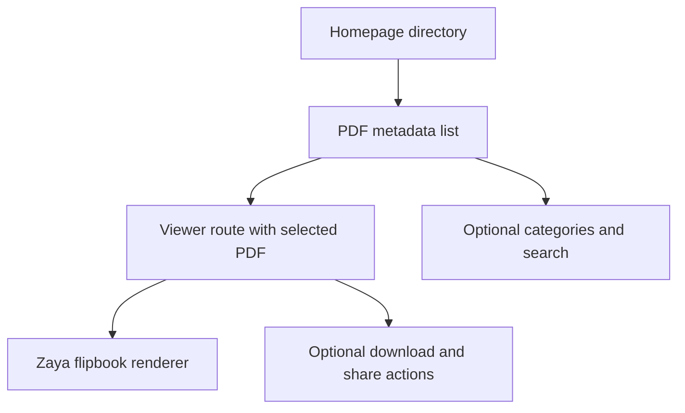
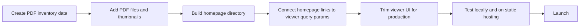

# PDF Website Implementation Plan

## Recommendation

Use the existing Zaya flipbook viewer as the primary implementation base. The current project already has the main pieces needed for a browser-based PDF reading experience:

- Main viewer page in [`index.html`](../Zaya-main/index.html)
- Script bootstrapping in [`loadApplication()`](../Zaya-main/lib/js/app.js:30)
- PDF loading and fallback behavior in [`loadFlipbook()`](../Zaya-main/lib/js/core/load.js:86)
- Bundled PDF rendering libraries in [`pdf.min.js`](../Zaya-main/lib/js/libs/pdf.min.js) and [`pdf.worker.min.js`](../Zaya-main/lib/js/libs/pdf.worker.min.js)

This makes the fastest path to launch a website that has:

1. a homepage that lists available PDFs
2. a dedicated viewer page for each PDF
3. optional future enhancements such as categories, featured documents, search, and metadata

## What Exists Today

The current viewer is a static front-end app, not a backend-driven system.

### Existing viewer capabilities

- Load a default PDF via [`window.ZAYA_DEFAULT_PDF`](../Zaya-main/index.html:18)
- Load a PDF from a query parameter as described in [`README.md`](../Zaya-main/README.md:40)
- Load a PDF from a pasted URL via the form in [`index.html`](../Zaya-main/index.html:132)
- Load a local PDF file through the hidden file input in [`index.html`](../Zaya-main/index.html:141)
- Render the book into [`#flipbookContainer`](../Zaya-main/index.html:336)
- Initialize all viewer dependencies through [`loadApplication()`](../Zaya-main/lib/js/app.js:30)

### Constraints to keep in mind

- Remote PDFs must allow CORS, noted in [`README.md`](../Zaya-main/README.md:54)
- The project is currently structured as a static site, so the simplest deployment path is static hosting
- The current UI is feature-rich, which is useful, but for a production document library you may want to simplify the controls

## Recommended Website Structure

Build the site as a static document library with two core page types.



### Page 1: Homepage directory

Purpose:

- Display all available PDFs
- Show title, thumbnail, description, tags, date, and author if available
- Link into the viewer page with a selected PDF

Suggested content blocks:

- Site hero or introduction
- Grid or list of PDF cards
- Category filters
- Search input
- Optional featured PDFs section

### Page 2: Viewer page

Purpose:

- Open one selected PDF in the existing Zaya viewer
- Preserve the current flipbook experience
- Allow deep-linking to a specific PDF from the homepage

Suggested route patterns:

- [`viewer.html?pdf=/pdfs/example.pdf`](viewer.html)
- [`index.html?pdf=/pdfs/example.pdf`](../Zaya-main/index.html)

The least disruptive option is to keep the current viewer logic and either:

- reuse [`index.html`](../Zaya-main/index.html) as the viewer page, or
- duplicate it into a cleaner dedicated [`viewer.html`](viewer.html) page later during implementation

## Step-by-Step Implementation Plan

### Step 1: Define the content model for the PDF library

Create a single source of truth for document metadata.

Recommended fields per PDF:

- `id`
- `title`
- `slug`
- `pdfPath`
- `thumbnail`
- `description`
- `category`
- `tags`
- `featured`
- `author`
- `publishedDate`

Recommended implementation:

- Add a static JSON or JavaScript data file such as [`data/pdfs.json`](../data/pdfs.json) or [`data/pdfs.js`](../data/pdfs.js)
- Store actual PDF files under a folder such as [`pdfs/`](../pdfs)
- Store thumbnails under [`assets/`](../Zaya-main/assets)

Example structure:

```json
[
  {
    "id": "issue-001",
    "title": "Issue 001",
    "slug": "issue-001",
    "pdfPath": "/pdfs/issue-001.pdf",
    "thumbnail": "/assets/thumbnails/issue-001.jpg",
    "description": "First issue of the publication",
    "category": "Magazine",
    "tags": ["featured", "issue-001"],
    "featured": true
  }
]
```

### Step 2: Decide how the homepage links into the viewer

Use query parameters first because they match the current viewer behavior documented in [`README.md`](../Zaya-main/README.md:40).

Recommended approach:

- Homepage card button links to [`index.html?pdf=/pdfs/issue-001.pdf`](../Zaya-main/index.html)
- Optional support for `page` such as [`index.html?pdf=/pdfs/issue-001.pdf&page=1`](../Zaya-main/index.html)

Why this is the best first step:

- no backend required
- no router required
- directly compatible with the current viewer logic
- easy to host on GitHub Pages or Vercel

### Step 3: Build a dedicated homepage directory

Create a new homepage for browsing PDFs.

Recommended page responsibilities:

- Load the PDF metadata file
- Render cards for each PDF
- Provide filters and search
- Send users into the viewer page

Suggested homepage features for version 1:

- card image thumbnail
- title
- short description
- category label
- open button

Suggested homepage features for version 2:

- featured section
- tag filters
- search by title or tags
- sort by date or alphabetical order

### Step 4: Refine the viewer for production use

The current viewer in [`index.html`](../Zaya-main/index.html) includes more than just PDF reading. It also includes quotes, media playback, theme controls, changelog links, and advanced controls.

For a document library site, decide which parts stay.

Keep by default:

- PDF rendering
- next and previous controls
- page number input
- outline and thumbnails
- fullscreen
- download if desired

Consider removing or hiding:

- GitHub link in [`index.html`](../Zaya-main/index.html:24)
- changelog link in [`index.html`](../Zaya-main/index.html:40)
- media player section in [`index.html`](../Zaya-main/index.html:148)
- quotes UI in [`index.html`](../Zaya-main/index.html:92)

This keeps the viewer focused on reading.

### Step 5: Organize the static asset structure

Recommended production structure:

```text
site-root/
  index.html
  viewer.html
  pdfs/
    issue-001.pdf
    issue-002.pdf
  assets/
    thumbnails/
    icons/
  data/
    pdfs.json
  lib/
    css/
    js/
```

If you keep the current Zaya layout, the simplest version is:

- homepage file at project root
- viewer file based on [`Zaya-main/index.html`](../Zaya-main/index.html)
- existing libraries preserved under [`Zaya-main/lib/`](../Zaya-main/lib)

### Step 6: Make PDF selection dynamic

The viewer should not be hardcoded to one document.

Implementation goal:

- homepage passes a PDF path
- viewer reads the query parameter
- viewer calls [`loadFlipbook()`](../Zaya-main/lib/js/core/load.js:86) with that selected PDF
- fallback default PDF remains in place through [`getDefaultPdfUrl()`](../Zaya-main/lib/js/utils/app-state.js:6)

This preserves resilience if a PDF fails to load.

### Step 7: Add thumbnails and metadata polish

For a professional homepage, each PDF should have a preview image.

Minimum per-card visual set:

- cover thumbnail
- title
- short summary
- category or tag
- open action

Optional additions:

- issue number
- reading length
- publication date
- downloadable file size

### Step 8: Prepare for static deployment

Before launch, verify:

- all asset paths are relative and valid
- PDF files are committed to the deploy target
- thumbnails load correctly
- query-parameter-based links work in production
- remote files are avoided unless CORS is guaranteed

## Components That Need To Be Built

### Required for launch

1. Homepage directory page
2. PDF metadata source file
3. PDF storage folder
4. Thumbnail image set
5. Viewer page wired to selected PDF
6. Clean navigation from homepage to viewer

### Strongly recommended

1. Search or filter UI
2. Featured PDFs section
3. Empty state when no PDFs exist
4. Error state when a PDF is missing
5. Consistent site branding across homepage and viewer

### Optional future features

1. Analytics
2. Recently added PDFs
3. Category landing pages
4. Reading progress persistence
5. Download tracking

## Technical Build Checklist

### Front-end

- Homepage layout
- PDF card component
- Viewer page cleanup
- Search and filter logic
- Navigation links
- Responsive styling

### Content and assets

- PDF uploads
- Thumbnails
- Metadata file
- Copywriting for descriptions

### QA

- Test local PDFs
- Test mobile layout
- Test desktop layout
- Test large PDFs
- Test missing file behavior
- Test CORS-sensitive remote PDFs if used

## Suggested Development Order



## Hosting Options With Free Plans

### 1. GitHub Pages

Best for:

- fully static sites
- simple deployment from a repository
- no server-side features required

Pros:

- free for public repositories
- excellent for HTML, CSS, JS, PDFs, and JSON data
- very simple if this remains a static site

Cons:

- less flexible than Vercel for future app-style features
- no serverless backend in the hosting layer
- path handling can be trickier on project subpaths

Recommendation:

- very good if the site remains a plain static PDF library

### 2. Vercel

Best for:

- static sites now with room to grow later
- cleaner deploy previews
- easier future migration to a framework site

Pros:

- generous free tier for personal projects
- easy drag-and-drop or Git-based deployment
- good performance and caching
- preview deployments on every push

Cons:

- more platform features than you need for a simple static-only site
- usage limits matter more if traffic grows heavily

Recommendation:

- strongest overall choice if you want flexibility and easy iteration

### 3. Netlify

Best for:

- static sites with form handling or lightweight deployment workflow features

Pros:

- very friendly for static front-end projects
- easy Git integration
- deploy previews available

Cons:

- similar to Vercel, but less compelling if you are not using its specific extras

Recommendation:

- good alternative to Vercel for a static PDF site

### 4. Cloudflare Pages

Best for:

- static sites that want fast global delivery

Pros:

- free tier available
- strong CDN performance
- good for static assets like PDFs and images

Cons:

- slightly less beginner-friendly depending on workflow familiarity

Recommendation:

- excellent if you want fast static hosting and are comfortable with setup

## Hosting Recommendation Summary

If the site is staying simple and static:

- choose GitHub Pages for simplicity

If the site may grow in design complexity or move into a framework later:

- choose Vercel as the best primary option

If you want another strong static-hosting alternative:

- choose Netlify or Cloudflare Pages

## Final Recommendation

Build the first release as a static PDF directory plus a dedicated Zaya-based viewer.

That means:

1. keep the existing viewer engine centered around [`loadFlipbook()`](../Zaya-main/lib/js/core/load.js:86)
2. add a homepage that lists your PDFs from a metadata source
3. link each homepage card into the viewer with a `pdf` query parameter
4. host everything on a static platform such as GitHub Pages or Vercel

This is the lowest-complexity path and matches the current codebase architecture.

## Execution Todo List

- Create a PDF inventory data file
- Add the PDF files and thumbnails
- Build the homepage directory
- Connect homepage links to the viewer page
- Simplify the current Zaya viewer UI for production
- Test all PDFs and fallback behavior
- Deploy to GitHub Pages or Vercel
